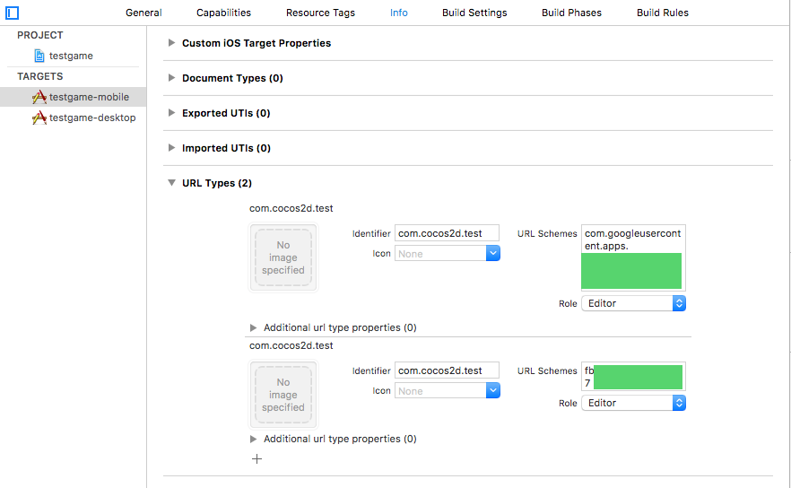
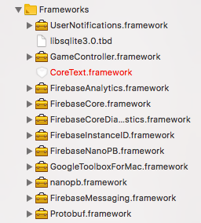
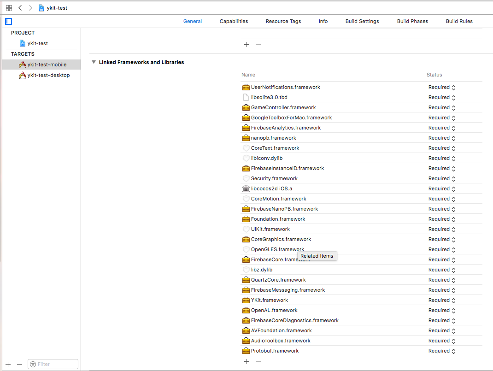
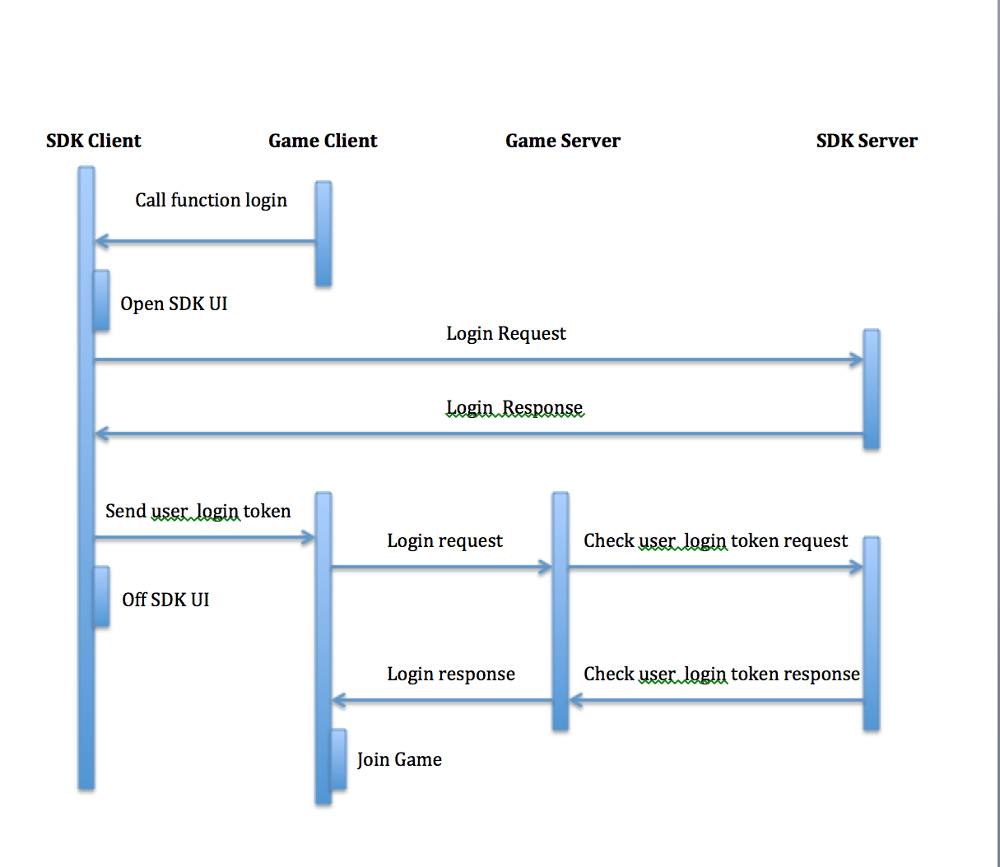
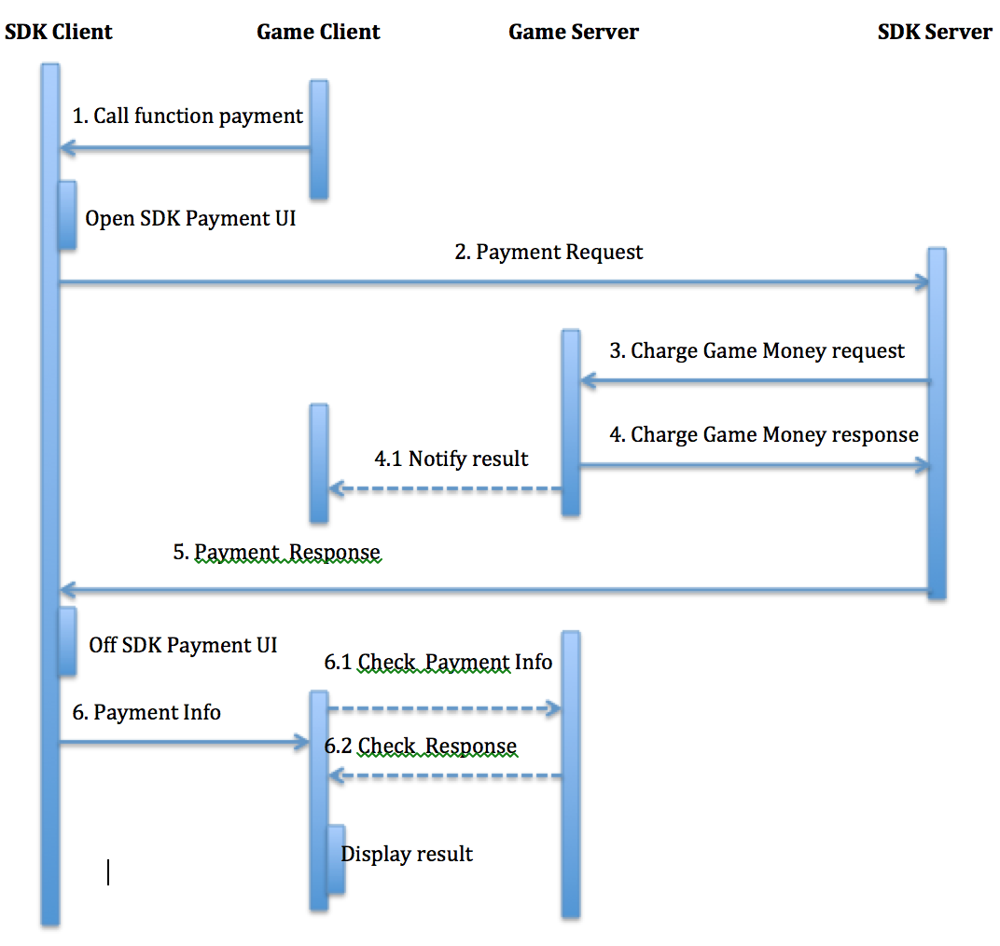

# YKitIOS for Native

## Get Started

YKit SDK for iOS is the most simple way to intergrate user and payment to YGame system.YKit SDK provide solution for payment such as: SMS, card, internet banking và Apple Payment.

## Steps to integrate SDK

    1. Setup YKit SDK
    2. Config SDK - Payment function
    3. YKit SDK flow

## Note
   - Make sure our project's deployment target is 8.0 at least.

### 1. Setup YKit SDK 
#### 1.1. Import YKit.framework into project

   - Drag and drop YKit.framework into your project.
   - Tick on checkbox: “Copy items into destination group's folder (if needed)”.
   - Embedded Binaries with SDK


#### 1.2. Add url schemes

   - Add the following url schemes for Facebook(“fb” + facebook app id) and Google sign in (Reverse client id) from YKitConfig.plist file
    


   - Go to ios info.plist
   - Add  facebook app id, facebook display name and application queries scheme as below. Please replace app id and display name with the value in the YKitConfig.plist file
   


   - Add file YKitConfig.plist to your root project (The current YKitConfig.plist in SDK folder is an example file. Remember to use YKitConfig.plist sent  Mr.Huy)

#### 1.3. Setup Code

- Import SDK : ```#import <YKit/YKit.h>``` in Cocos AppController.m

- Add these lines of code in Application didFinishLaunchingWithOptions function in AppController class, after window setup. You can get Google Signin client ID in the YKitConfig.plist.

```
- (BOOL)application:(UIApplication *)application didFinishLaunchingWithOptions:(NSDictionary *)launchOptions {
    // Project configure
    
    
    // Start YKIT CONFIGURING
    YKit *launcher = [YKit getInstance];
        
    launcher.isPotrait = NO;
    
    //
    // if using facebook API, you need to implement 
    // [launcher setPermissionFacebook:@"public_profile"]; // string is the permission you want to 
    //
    [launcher setupWithWindow:window usingFacebookSDK:YES];
    [launcher setPermissionFacebook:@"public_profile"];
    
    // Handle login callback
    [launcher handleLoginWithCompletion:^(NSDictionary *data) {
         [launcher getFacebookInfo];
         NSString *userID = data[kParamUserID];
         NSString *userName = data[kParamUserName];
         NSString *accessToken = data[kParamAccessToken];
         //  NSLog(@"sample %@" ,[launcher getFacebookInfo]);
         [launcher showButtonLauncherWithAnimation:YES];
    }];
        
    // Handle logout callback
    [launcher handleLogoutWithCompletion:^{
            //do something
    }];
    
    // handle payment callback
    [launcher handlePaymentWithCompletion:^(NSString *data){
         NSLog(@"Payment success! %@", data);
    }];
        
    //    NSLog(@"sample %@" ,[launcher getFacebookInfo]);
    [launcher setDomainDebug:YES];
   
    if ([launcher silentLogin]) {
            
    }
    // Example usage of silentLogin. For more information, check the public functions section.
    //if([launcher silentLogin]){
    //    // Move direct to game
    //}
    //else {
    //    // Show login screen
    //    [launcher showLoginScreen];
    //}
    
    
    // Example usage of setting up payment and then buy it. For more information, check section 2. Implementation payment info
    //[launcher setPaymentInfo:@"Server ID" andCharId:@"Character ID" andPayment:@"Payment package ID"];
    //[launcher buyItemWithGameOrder];

    
    [launcher handleShowSDKCompletion:^{
        NSLog(@"I'm in xD");
    }];
    
    
    NSString* appID = [[[NSBundle mainBundle] infoDictionary] objectForKey:@"CFBundleIdentifier"];
    [launcher handleCloseSDKCompletion:^{
        NSLog(@"queee");
    }];
        
    NSDictionary *dict = @{kParamApplication: ATNonNilObject(application),
                           kParamOptions: ATNonNilObject(launchOptions)};
    ATDispatchEvent(Event_AppDidFinishLaunching, dict);    
    // END YKIT CONFIGURING
    
    return YES;
}

```
- In the previous code, we provide two callback functions. There are handleLoginWithCompletion and handleLogoutWithCompletion. You may use these functions to call login or logout with your server
            
- Add function handle Facebook schemes 

```
- (BOOL)application:(UIApplication *)application openURL:(NSURL *)url sourceApplication:(NSString *)
            sourceApplication annotation:(id)annotation { 

            NSDictionary *dict = @{kParamApplication: ATNonNilObject(application), kParamUrl: ATNonNilObject(url), 
            kParamSourceApplication: ATNonNilObject(sourceApplication), kParamAnnotation: ATNonNilObject(annotation)}; 

            ATDispatchEvent(Event_AppOpenUrl, dict); 

            return YES; 
}
```

- This example code is apply for landscape mode.You can set it through "didFinishLaunchingWithOptions"

		[YKit getInstance].isPotrait = YES (Potrait only);
		// else landscape is NO;			
- Base on your game orientation, if your game support both portrait and landscape then you must replace UIInterfaceOrientationMaskLandscape with UIInterfaceOrientationMaskAll, if you game is only support portrait mode, then you don’t need to add this function.
	
```
- (UIInterfaceOrientationMask)application:(UIApplication *)application supportedInterfaceOrientationsForWindow:(UIWindow *)window
            { 

            if ([[YKit getInstance] isScreenRotateToPortrait]) { 

            return UIInterfaceOrientationMaskPortrait; 

            } else 	
            
            return UIInterfaceOrientationMaskLandscape; 
            
            } 
```
#### 1.4. Setup Firebase Push-Notifications
##### 1.4.1 Setup Firebase framework

- Drap & drop firebase frameworks into your game. (Remember to target your project)



- Drap & drop GoogleService-Info.plist into your game (Remember to target your project)


- Add the -ObjC linker flag in your Other Linker Settings in your target's build settings.


- Add firebase.h next to your appcontroller (Remember to target your project)


- In Linked Frameworkds and Libraries. Click the + Icon down below and add there 3 frameworks: 
    - libsqlite3.0.tbd
    - GameController.framework
    - UserNotifications.framework

 

 


##### 1.4.2 Setup firebase code

- In your appcontroller.h, ```#import "Firebase.h"``` and add FIRMessagingDelegate to the interface like picture below

- Add these pre-defined macros for firebase above Implementation

```
// Implement UNUserNotificationCenterDelegate to receive display notification via APNS for devices
// running iOS 10 and above.
#if defined(__IPHONE_10_0) && __IPHONE_OS_VERSION_MAX_ALLOWED >= __IPHONE_10_0
#import <UserNotifications/UserNotifications.h>
@interface AppController () <UNUserNotificationCenterDelegate>
@end
#endif

// Copied from Apple's header in case it is missing in some cases (e.g. pre-Xcode 8 builds).
#ifndef NSFoundationVersionNumber_iOS_9_x_Max
#define NSFoundationVersionNumber_iOS_9_x_Max 1299
#endif

#define SYSTEM_VERSION_GRATERTHAN_OR_EQUALTO(v)  ([[[UIDevice currentDevice] systemVersion] compare:v options:NSNumericSearch] != NSOrderedAscending)
```

- Start firebase: Add these code to didFinishLaunchingWithOptions in your appcontroller.m after ykit setup

```
    // [START configure_firebase]
    [FIRApp configure];
    // [END configure_firebase]
    
    // [START set_messaging_delegate]
    [FIRMessaging messaging].delegate = self;
    // [END set_messaging_delegate]
```

- Setup to receive push notifications: Add these code to didFinishLaunchingWithOptions in your appcontroller.m after firebase configure

```
if (floor(NSFoundationVersionNumber) <= NSFoundationVersionNumber_iOS_7_1) {
        // iOS 7.1 or earlier. Disable the deprecation warnings.
#pragma clang diagnostic push
#pragma clang diagnostic ignored "-Wdeprecated-declarations"
        UIRemoteNotificationType allNotificationTypes =
        (UIRemoteNotificationTypeSound |
         UIRemoteNotificationTypeAlert |
         UIRemoteNotificationTypeBadge);
        [application registerForRemoteNotificationTypes:allNotificationTypes];
#pragma clang diagnostic pop
    } else {
        // iOS 8 or later
        // [START register_for_notifications]
        if (floor(NSFoundationVersionNumber) <= NSFoundationVersionNumber_iOS_9_x_Max) {
            UIUserNotificationType allNotificationTypes =
            (UIUserNotificationTypeSound | UIUserNotificationTypeAlert | UIUserNotificationTypeBadge);
            UIUserNotificationSettings *settings =
            [UIUserNotificationSettings settingsForTypes:allNotificationTypes categories:nil];
            [[UIApplication sharedApplication] registerUserNotificationSettings:settings];
        } else {
            // iOS 10 or later
#if defined(__IPHONE_10_0) && __IPHONE_OS_VERSION_MAX_ALLOWED >= __IPHONE_10_0
            // For iOS 10 display notification (sent via APNS)
            [UNUserNotificationCenter currentNotificationCenter].delegate = self;
            UNAuthorizationOptions authOptions =
            UNAuthorizationOptionAlert
            | UNAuthorizationOptionSound
            | UNAuthorizationOptionBadge;
            [[UNUserNotificationCenter currentNotificationCenter] requestAuthorizationWithOptions:authOptions completionHandler:^(BOOL granted, NSError * _Nullable error) {
            }];
#endif
        }
        
        [[UIApplication sharedApplication] registerForRemoteNotifications];
        // [END register_for_notifications]
    }
```

- Setup handling message: Add these functions to your appcontroller.m

```
// [START receive_message]
- (void)application:(UIApplication *)application didReceiveRemoteNotification:(NSDictionary *)userInfo {
    [[YKit getInstance] appDidReceiveMessage:userInfo];
}

- (void)application:(UIApplication *)application didReceiveRemoteNotification:(NSDictionary *)userInfo
fetchCompletionHandler:(void (^)(UIBackgroundFetchResult))completionHandler {
    [[YKit getInstance] appDidReceiveMessage:userInfo];
    completionHandler(UIBackgroundFetchResultNewData);
}
// [END receive_message]

// [START ios_10_message_handling]
// Receive displayed notifications for iOS 10 devices.
#if defined(__IPHONE_10_0) && __IPHONE_OS_VERSION_MAX_ALLOWED >= __IPHONE_10_0
// Handle incoming notification messages while app is in the foreground.
- (void)userNotificationCenter:(UNUserNotificationCenter *)center
       willPresentNotification:(UNNotification *)notification
         withCompletionHandler:(void (^)(UNNotificationPresentationOptions))completionHandler {
    NSDictionary *userInfo = notification.request.content.userInfo;
    [[YKit getInstance] appDidReceiveMessage:userInfo];
    // Change this to your preferred presentation option
    completionHandler(UNNotificationPresentationOptionNone);
}

// Handle notification messages after display notification is tapped by the user.
- (void)userNotificationCenter:(UNUserNotificationCenter *)center
didReceiveNotificationResponse:(UNNotificationResponse *)response
         withCompletionHandler:(void(^)())completionHandler {
    NSDictionary *userInfo = response.notification.request.content.userInfo;
    [[YKit getInstance] appDidReceiveMessage:userInfo];
    completionHandler();
}
#endif
// [END ios_10_message_handling]

// [START refresh_token]
- (void)messaging:(nonnull FIRMessaging *)messaging didRefreshRegistrationToken:(nonnull NSString *)fcmToken {
    [[YKit getInstance] setFCMToken:fcmToken];
}
// [END refresh_token]

// [START ios_10_data_message]

- (void)messaging:(FIRMessaging *)messaging didReceiveMessage:(FIRMessagingRemoteMessage *)remoteMessage {
    [[YKit getInstance] appDidReceiveMessage:remoteMessage.appData];
}
// [END ios_10_data_message]

- (void)application:(UIApplication *)application didFailToRegisterForRemoteNotificationsWithError:(NSError *)error {
    NSLog(@"Unable to register for remote notifications: %@", error);
}

- (void)application:(UIApplication *)application didRegisterForRemoteNotificationsWithDeviceToken:(NSData *)deviceToken {
    NSString *fcmToken = [FIRMessaging messaging].FCMToken;
    [[YKit getInstance] setFCMToken:fcmToken];
}
```
#### 1.5. Public functions
- Here is the list of public functions you can call to customize the YKit in your game: 

* setLauncherStickySide: You can specific the side that launcher can stick to via the or bitwise. 
Ex: ATButtonStickySideTop | ATButtonStickySideBottom 

* silentLogin: When open the app, maybe user is already logged in. Call this function to check if user is logged in or not, if not, you must call showLoginScreen function to show the login screen. 

```
if([[YKit getInstance] silentLogin])
	// Move direct to game
else {
	// Show login screen
	[[YKit getInstance] showLoginScreen];
}
```
        
* showButtonLauncherWithAnimation 
* hideButtonLauncherWithAnimation
* showLoginScreen: Show the login screen, if user not logged in yet
* showPaymentScreen: You may want to show payment screen from your game
* handleShowSDKCompletion: You can get the event show SDK here
* handleCloseSDKCompletion: You can get the event show SDK here
### 2. Implement Payment Info

Payment Info is the data you send to game server when user make payment. 
For example: if your game have multiple servers or multiple characters, you may want to send this data to game server, so its will know which character get the gold. The format is defined on your demand. 
    
Note*: 
* It must be unique string
* Maximum is 50 characters
* There's no special character in string

To use it, we call from ykit.
```
setPaymentInfo:(NSString*)serverId andCharId:(NSString*)charId andPayment:(NSString*)payment;
```
Example usage

```
[ykit setPaymentInfo:@"Server ID" andCharId:@"Character ID" andPayment:@"Payment package"];

//This is the command to sending the payment info to game server.
//[ykit buyItemWithGameOrder];
```
    
### 2. Flow

#### 2.1. Login flow: 


#### 2.2. Payment flow:


### 3. Build note
Please input full information in Xcode before build the product
- Display Name: name appear on the device
- Bundle identifier: bundle id of your game which provided by YGame
- Version: string, for example: 1.0.0
- Build: number, for example: 100


